# Giraffegotchi


A Tamagotchi-style digital pet running on an ESP32 **"Cheap Yellow Display" (CYD)**. It began as a giraffe and is now a **swappable-animal platform**: each animal is one *data descriptor* — its own sprites, animations, biome, and food — and you switch between them right on the device. Ships with four: a **giraffe** (savanna), a **groundhog** (meadow), a **flamingo** ("frances", lagoon), and a **cheetah** ("spot", plains). Feed, water, play, and clean up on a 240×320 touchscreen, in a hand-drawn world that follows the real sun.

## What it does

Tap five buttons to keep your pet happy. Its mood is driven by four care meters, and its world is driven by the actual time and your location — sunrise, sunset, and the day/night cycle are computed on-device.

### Care model
- **Four meters:** Hunger, Thirst, Fun, Hygiene. Hunger/Thirst/Fun drain slowly (~1 pt/min); Hygiene drops when the pet poops.
- **Five actions:** FEED, DRINK, PLAY, CLEAN, BOOK (read).
- **10 emotion sprites** — happy, hungry, thirsty, bored, dirty, sad, sick, sleepy, excited, reading — resolved by priority from the meters.
- **Poop** spawns on a timer and must be cleaned.
- **Rotating PLAY mini-games:** butterfly, bubbles, and per-animal signature moves (the giraffe kicks a ball / flies a kite).

### Multiple animals
- **Switch on-device:** hold **BOOK** (~0.8 s) to open a full-screen picker grid, tap an animal's tile to swap.
- **Each animal is its own world:** its sprites, animation set, and **biome** (sky palette, ground, grass, trees, critters) all change with it.
- **Independent lives:** every animal keeps its **own** care state — swapping never resets or shares stats. Each pet runs on its own clock.
- **Persistent:** the chosen animal and every animal's state survive power loss (NVS); the device boots straight back into your pet.

### Day/night cycle (synced to real time + your location)
- One-shot **WiFi + NTP** time sync at boot, then WiFi drops — the RTC keeps time.
- **Sunrise/sunset** computed locally from your lat/long (NOAA almanac), recomputed daily. No API needed.
- **Eight sky phases**, each biome with its own palette. **Sun and moon** arc overhead, passing behind the pet and trees at their peak. Stars and fireflies at night.
- Offline-safe: no WiFi → stays daytime.

### A living world
- **Idle tics** (blink, ears, tail), **daydream bubbles**, ambient **clouds/birds/butterflies/fireflies**, and **night sleep** (~30 min after sunset until sunrise; decay pauses so you don't wake to a sick pet).

### Quality-of-life
- **Save state** per animal (stats + poop + the prank-death flag) in NVS.
- **Auto-dim** backlight after 5 min idle. **180° mountable** (display + touch flipped in firmware).

### Easter egg 🥚
Mash the care buttons fast and the pet "dies" (a prank — survives a power cycle). Mash **BOOK** fast to revive.

## Hardware

- **[ESP32-2432S028R "Cheap Yellow Display" (CYD)](https://amzn.to/4vJQgwv)** — ILI9341 240×320 TFT with resistive XPT2046 touch. The board has display, touch, USB, and power built in — that's the whole BOM.

## Configuration

WiFi credentials and location live in a gitignored `.env`, injected as build flags by `tools/load_env.py`:

```ini
WIFI_SSID="Your Network"
WIFI_PW="your-password"
LAT=30.0858                  # latitude
LON=-97.8403                 # longitude
TZ=CST6CDT,M3.2.0,M11.1.0    # POSIX timezone (handles DST)
```

Without `.env`, it still builds and runs — just skips WiFi/time and stays daytime.

## Dev commands

Requires [PlatformIO](https://platformio.org/) (`pio`) and, for the art pipeline, [bun](https://bun.sh) + Python 3.12. Common tasks are wrapped as bun scripts (`package.json`):

| Command | What |
|---|---|
| `bun run help` | list these commands |
| `bun setup` | one-time: create `.venv` + install Pillow + numpy (art pipeline) |
| `bun compile` | build firmware |
| `bun upload` | flash firmware |
| `bun uploadfs` | flash sprites (`data/`) to LittleFS |
| `bun flash` | firmware **+** sprites |
| `bun native` | run the pet-logic unit tests (43, host-native) |
| `bun monitor` | serial monitor |
| `bun run cleanart <name>` | clean raw source art in `img/<name>/` (bg-remove + align frames) |
| `bun run cleanart:revert <name>` | restore originals from `img/<name>/.backups/` |
| `bun prep [name]` | process art (all species, or one: `bun prep giraffe`) |

Rule of thumb: **`bun upload`** for code-only changes; **`bun flash`** (or add `bun uploadfs`) whenever sprites in `data/` changed. Raw equivalents are plain `pio run -e esp32dev -t <target>`.

## Art pipeline

Animals are illustrated art, not procedural. Two stages: **`cleanart`** preps raw generated art into clean transparent source, then **`prep`** converts that source into shipped sprites.

```
raw art  ──cleanart──►  img/<species>/*.png (clean, transparent)  ──prep──►  data/<species>/*.png (sprites)
```

### 1. `cleanart` — prep the raw art (`tools/clean_art.py`)

LLM-generated frames arrive with a background to strip and a few pixels of drift between frames. `bun run cleanart <species>` fixes both, **in place** in `img/<species>/`:

- **Background → true transparent PNG.** A border-connected flood fill keys the flat light background (incl. ChatGPT's fake-transparent white/gray checkerboard) but stops at the hard black outline — so interior pink can't hole through and interior light areas (book pages) stay. Not ML; deterministic.
- **Frame registration.** Body poses are aligned to a reference by the shift that maximizes silhouette overlap (FFT cross-correlation), so the body doesn't drift between frames and you can copy a part from one frame onto another cleanly.
- **Backups + revert.** Originals go to `img/<species>/.backups/`; `bun run cleanart:revert <species>` restores them. `dead`, `icon`, and `kick*` are background-removed but not nudged; `objects/` are background-removed only.

Tune barriers/margins at the top of `tools/clean_art.py` (`OUTLINE_DARK`, `FLOOD_SAT`, `MARGIN`, `REF_POSE`).

### 2. `prep` — convert to sprites (`tools/prep_sprite.py`)

`tools/prep_sprite.py` keys the transparent pixels to magenta (the firmware's transparency color), autocrops, aligns frames to a common box, downsamples, and writes the `data/<species>/` sprites shipped to LittleFS. It reports the LittleFS budget and fails if over.

```
img/<species>/*.png            body poses      -> data/<species>/<pose>.png
img/<species>/objects/*.png    props / food    -> data/<species>/<name>.png
img/<species>/icon.png         picker icon     -> data/<species>/icon.png (small)
```

Run `bun prep` (all) or `bun prep <species>` (one), then `bun uploadfs`.

## Adding an animal

An animal is **data + art** — no engine changes (that's the whole point of the refactor). Using an AI coding agent? Point it at [`docs/adding-an-animal-agent.md`](docs/adding-an-animal-agent.md) — a step-by-step playbook that encodes the invariants and the food+biome rule. The full pose set looks like this (flamingo — click any thumbnail for the full-size image):

<table>
<tr>
<td align="center"><a href="img/flamingo/happy.png">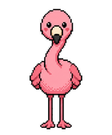</a><br><code>happy</code></td>
<td align="center"><a href="img/flamingo/happy2.png">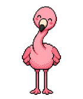</a><br><code>happy2</code></td>
<td align="center"><a href="img/flamingo/happy3.png">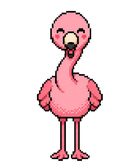</a><br><code>happy3</code></td>
<td align="center"><a href="img/flamingo/excited.png">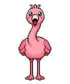</a><br><code>excited</code></td>
<td align="center"><a href="img/flamingo/reading.png">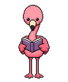</a><br><code>reading</code></td>
</tr>
<tr>
<td align="center"><a href="img/flamingo/hungry.png">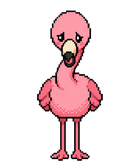</a><br><code>hungry</code></td>
<td align="center"><a href="img/flamingo/thirsty.png">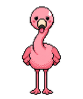</a><br><code>thirsty</code></td>
<td align="center"><a href="img/flamingo/sad.png">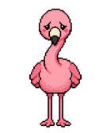</a><br><code>sad</code></td>
<td align="center"><a href="img/flamingo/sick.png">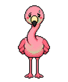</a><br><code>sick</code></td>
<td align="center"><a href="img/flamingo/sleepy.png">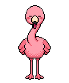</a><br><code>sleepy</code></td>
</tr>
<tr>
<td align="center"><a href="img/flamingo/bored.png"></a><br><code>bored</code></td>
<td align="center"><a href="img/flamingo/dirty.png">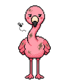</a><br><code>dirty</code></td>
<td align="center"><a href="img/flamingo/blink.png">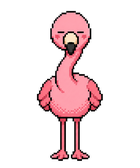</a><br><code>blink</code></td>
<td align="center"><a href="img/flamingo/ears_up.png">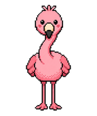</a><br><code>ears_up</code></td>
<td align="center"><a href="img/flamingo/ears_down.png">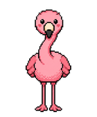</a><br><code>ears_down</code></td>
</tr>
<tr>
<td align="center"><a href="img/flamingo/tail_left.png">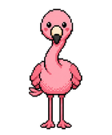</a><br><code>tail_left</code></td>
<td align="center"><a href="img/flamingo/kick.png">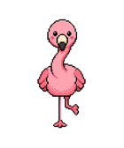</a><br><code>kick</code></td>
<td align="center"><a href="img/flamingo/kick2.png">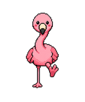</a><br><code>kick2</code></td>
<td align="center"><a href="img/flamingo/dead.png">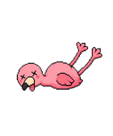</a><br><code>dead</code></td>
<td align="center"><a href="img/flamingo/icon.png">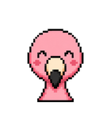</a><br><code>icon</code></td>
</tr>
</table>

To add one, say a flamingo:

1. **Generate art** → use [`docs/PET_PROMPT.md`](docs/PET_PROMPT.md): fill its two `{{...}}` slots (animal + look) and paste it into ChatGPT to produce the 19 poses (`happy`, `happy2`, `hungry`, `sad`, `excited`, `sleepy`, `sick`, `reading`, `thirsty`, `bored`, `dirty`, `dead`, `blink`, `ears_up`, `ears_down`, `tail_left`, plus any signature-move poses), the `icon`, and an optional `food` item. Save them into `img/flamingo/` (props/food under `img/flamingo/objects/`).
2. **Clean** → `bun run cleanart flamingo` (bg-remove + align frames; originals backed up to `img/flamingo/.backups/`, revert with `bun run cleanart:revert flamingo`).
3. **Prep** → `bun prep flamingo` (keys + aligns + reports budget) → `data/flamingo/`.
4. **Descriptor** → add `src/species/flamingo.cpp`: a `Species` (name, `displayName`, `assetFolder`, `geom`, `anchors`, `caps`, `anims`, `biome`, optional `food`, `icon`) plus its `AnimSet` and a `Biome`. Copy `groundhog.cpp` and edit the values — geometry `W/H/X/Y`, anchor points, the pose-name frame lists, the 8-phase palette, grass/stars/fireflies, and (optional) tree hook.
5. **Register** → add `extern const Species FLAMINGO;` and `&FLAMINGO` to the `SPECIES[]` list in `src/species/registry.cpp`.
6. **Build + flash** → `bun native && bun flash`. Hold BOOK → the flamingo tile appears in the picker.

Notes: `displayName` is the picker label (the pet's given name, e.g. `"frances"`) and is separate from the internal `name` used for the asset folder + save id. Signature moves (kick/kite) are opt-in `Capability` flags; a species that omits them just doesn't run that code. The pose buffer is sized to the largest species automatically, so a bigger animal is fine.

## Project layout

Layered, one-way dependencies (`main → {render, anim, species, core} → hardware`):

| Path | What's there |
|---|---|
| `src/pet.{h,cpp}` + `src/core/sky.{h,cpp}` | Hardware-free core logic: `pet` (meters/emotions/decay/sleep) + `sky` (solar/phase math). Unit-tested on `native`. |
| `src/species/` | The `Species`/`AnimSpec`/`Biome` data types (`species.h`), the `registry`, and each animal as a data file (`giraffe.cpp`, `groundhog.cpp`). |
| `src/anim/` | `engine` — the data-driven animation player (pose floor, idle tics, foreground composers, per-species food). |
| `src/ui.{h,cpp}` (render layer) | Pixels: biome scene, sun/moon arc, compositing band, sprite decode, meters/buttons/picker primitives. |
| `src/io/` → `save.{h,cpp}` | NVS persistence: per-species care blocks + active-species id. |
| `src/main.cpp` | Orchestration: `setup`/`loop`, touch, WiFi/NTP, the active-species pointer + atomic swap, backlight. |
| `test/` | Unity tests (`test_pet`, `test_sky`). |
| `tools/` | `clean_art.py` (raw-art prep), `prep_sprite.py` (sprite conversion), `load_env.py` (`.env` → flags). |
| `img/` → `data/` | Per-species source art → processed LittleFS sprites. |

## Docs

- [`docs/architecture.md`](docs/architecture.md) — the post-refactor architecture: modules, invariants, and the swappable-species design.
- [`docs/development-guide.md`](docs/development-guide.md) — build/flash/test, the art pipeline, adding an animal.
- [`docs/STATUS.md`](docs/STATUS.md) — rendering internals, the compositing band, display/transparency gotchas.
- [`docs/PET_PROMPT.md`](docs/PET_PROMPT.md) — the ChatGPT prompt for generating a new animal's sprite set.
- `_bmad-output/planning-artifacts/` — the architecture spine (AD-1..15) + the epic/story backlog the refactor was built from.
