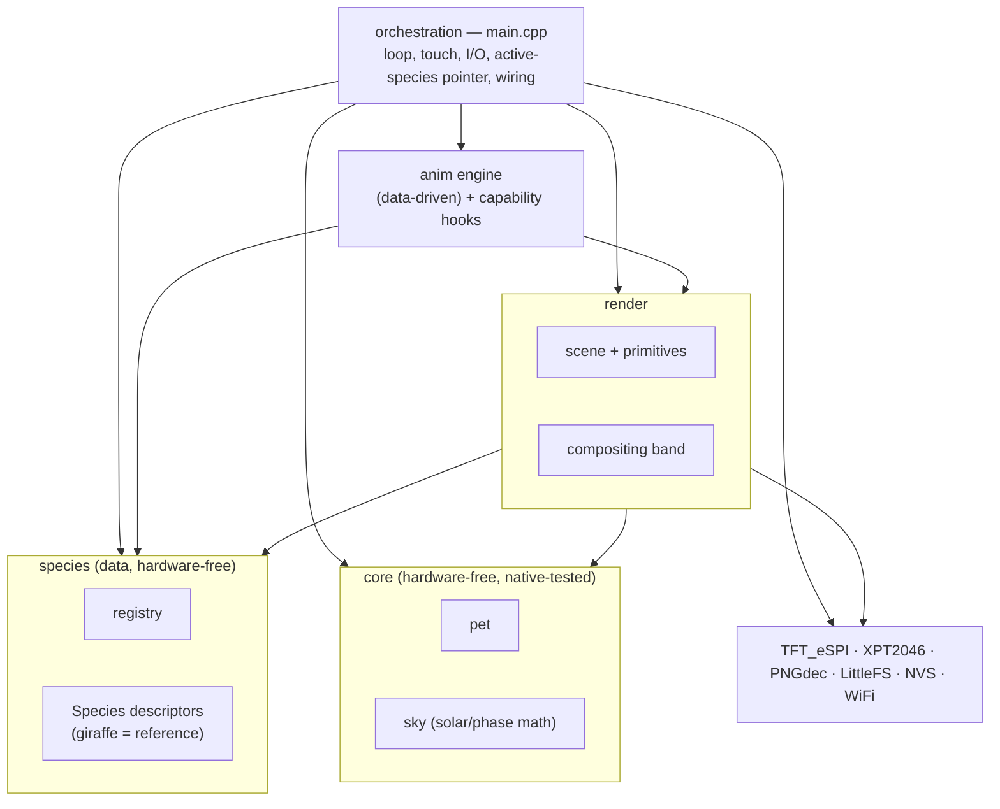

# Architecture Spine — giraffegotchi

## Design Paradigm

**Layered, single-threaded game loop + a data-driven species registry.** The giraffe stops being hardcoded and becomes **one descriptor in a registry**; render and animation read the *active* descriptor, so a different animal is data, not a code fork. Dependencies point one way only:

- **core/** — pure domain logic, no hardware. `pet` (species-agnostic already) + `sky` (solar/phase math). Compiles and unit-tests under `env:native`.
- **species/** — the `Species` descriptor type + the registry + each animal expressed **as data** (the giraffe is the reference entry). No pixels, no hardware — pure declarations the layers above consume.
- **anim/** — a generic, species-agnostic animation **engine** that plays animations described as data, plus named capability hooks for signature moves.
- **render/** — everything that touches pixels: scene, primitives, the compositing band. The **scene renders the active biome** (palettes, ground, grass/trees/props, critters) from the descriptor — the savanna is no longer baked in; it's the giraffe's biome data.
- **orchestration** — `main.cpp`: the `setup()`/`loop()` frame driver. Owns timing, touch, I/O, the **active-species pointer**, and wires the layers.

The `env:native` test split already proves the core boundary — this spine ratifies and extends it. **The refactor's real job is to relocate every giraffe-specific fact out of render/`main` and into the species descriptor**; splitting the big files is a means to that, not the end.



## Invariants & Rules

### AD-1 — Pure domain core stays hardware-free `[ADOPTED]`
- **Binds:** `pet`, and any extracted pure-logic module (`sky` solar/phase math).
- **Prevents:** Arduino/TFT/FS includes leaking into logic, which breaks `env:native`.
- **Rule:** Any module compiled under `env:native` includes **no** Arduino/TFT/FS headers and ships with Unity tests. To make logic testable, extract it to core rather than test it on-device.

### AD-2 — Layer dependency direction is one-way
- **Binds:** all.
- **Prevents:** cycles; render reaching into orchestration; core depending on render.
- **Rule:** `main → {render, core} → hardware libs`. `core` depends on nothing. `render` may use `core` (`Emotion`, thresholds) but never `main`. No module depends upward.

### AD-3 — Orchestration owns frame cadence and the panel
- **Binds:** `main`, `render`, `anim`.
- **Prevents:** two modules pushing to the TFT out of order → tearing / race on the single panel.
- **Rule:** Only the loop issues the top-level composite-and-push. Render/anim modules expose draw functions that **take a target surface** (`TFT_eSPI&` or `TFT_eSprite&`); they never own timing and never call the top-level push.

### AD-4 — One compositing band owns the giraffe footprint `[ADOPTED]`
- **Binds:** `render`, `anim`, `main`.
- **Prevents:** half-drawn frames / flicker on the un-double-buffered panel.
- **Rule:** In-box content (x 85–235, y 34–194) composites into the single `skyBand` sprite, pushed in **one** atomic `pushSprite` per frame. Out-of-box content draws direct with a `setViewport` **pixel-clip**. Nothing draws directly to the panel inside the box; nothing is skipped whole-object at the seam.

### AD-5 — Pose-buffer ownership & animation contract `[ASSUMPTION]`
- **Binds:** `anim`, `render`, `main`.
- **Prevents:** two code paths writing `giraffeBuf` in the same frame → wrong pose; ambiguous "who owns the giraffe this frame."
- **Rule:** `giraffeBuf` (the pose buffer) has exactly **one writer per frame, chosen by explicit priority — not loop order**: `dead > kick pose > idle tic > emotion/happy-frame`. **Pose-writing** animations (kick, tics, happy-rotation) write the buffer under that priority; **foreground-only** animations (eat, sleep Z's, bubbles, butterfly, daydream, clean) compose into the band and **never** touch `giraffeBuf`. All pose writes go through the render sprite-decode API (`renderSpriteToBuffer` / `renderGiraffeToBuffer`), never the raw decoder globals (see AD-10). An extracted `anim` module exposes `start(now)` / `tick(now)` / `compose(band)` and never pushes to the panel.
- ⚠️ **Ratify:** this is the one non-obvious call and it constrains the `anim` extraction. Confirm the writer priority (`dead > kick > tic > emotion`) and the pose-writer / band-composer split before that epic.

### AD-6 — Single transparency-key source `[ADOPTED]`
- **Binds:** `render`, art pipeline.
- **Prevents:** sprite holes / divergent keying across render paths.
- **Rule:** Magenta `0xF81F` is the global transparency key, read at runtime from `giraffeBuf[0]` — never a second hardcoded literal. It must never appear inside a silhouette. Changing it requires updating `tools/prep_sprite.py` `MAGENTA_RGB` in lockstep.

### AD-7 — `restoreBg` is the only erase `[ADOPTED]`
- **Binds:** `render`, `anim`.
- **Prevents:** flat fills that skip prop/band repaint → trails, stale pixels.
- **Rule:** All erase-to-background goes through `restoreBg(x,y,w,h)`. Never `fillRect` with a background colour to erase; never panel readback (`readRect` is broken on this CYD — restore by re-decoding to RAM or recompositing the band).

### AD-8 — Persistence: versioned NVS blob, throttled, restore-as-is `[ADOPTED]`
- **Binds:** `save`.
- **Prevents:** an unversioned layout change corrupting reads; flash wear; time-aging the pet on restore.
- **Rule:** `PetSave` is a fixed struct guarded by `SAVE_MAGIC` (bump on any layout change). Saves are throttled ≤ once / 5 s and only when dirty. Restore does **not** advance decay. Only `Pet` stats + the prank-death flag persist.

### AD-9 — Config/secrets via build-flag injection `[ADOPTED]`
- **Binds:** all, build.
- **Prevents:** secrets in source; the build requiring `.env` to exist.
- **Rule:** WiFi/lat/lon/TZ come from `.env` via the `tools/load_env.py` pre-build hook as `-D` flags. Every injected flag has a `#ifndef` in-source fallback. No credentials are committed.

### AD-10 — One writer per shared datum
- **Binds:** all render / io / anim mutable state.
- **Prevents:** two modules both writing one piece of shared mutable state after the split → desync (two-tone sky, stale phase, clobbered decode target). AD-6 fixes this for the transparency key only; this generalizes it.
- **Rule:** Every shared mutable datum has exactly **one owning module** that writes it; other modules read through the owner's API, never a second copy or a direct global poke. Ownership after the split:

  | Datum | Owner | Access by others |
  | --- | --- | --- |
  | `SKY_COLOR` / `GROUND_COLOR` palette | `render/scene` (via `setSkyPhase`) | read-only |
  | Sky phase id | `render/scene` — **single copy**; collapse today's `s_dayPhase` (main) + `s_phaseId` (ui) into `currentSkyPhase()` | `daynight` computes the value from the clock and calls `setSkyPhase(p)`; never keeps its own copy |
  | Celestial pos + `s_celForce` | `render/scene` | `daynight` sets via `setCelestial()` |
  | Cloud / bird / firefly / flutter arrays | `render/scene` | — |
  | PNG decoder globals `g_tft` / `g_buf` / `g_bufW` / `png` | `render` (**private**; non-re-entrant) | callers use `renderSpriteToBuffer` / `renderGiraffeToBuffer` only — never repoint the globals |
  | `giraffeBuf` pose buffer | writer per **AD-5** | `render` composites it into the band |
  | `s_lastInteract` / backlight / dim state | `main` (orchestration) | — |

### AD-11 — Single source of species-specific truth
- **Binds:** `species`, `render`, `anim`, all.
- **Prevents:** giraffe-isms leaking back into code; two places defining an animal so a swap misses one.
- **Rule:** Everything species-specific — asset folder, geometry (`W/H/X/Y`, **horizon, footprint**), anchor points (mouth, sleep-Z, daydream), the animation set, capability flags, an **optional food item** (sprite + eat params; the eat animation falls back to the drawn apple primitive when absent), **and the biome** (see AD-15) — lives **only** in the active `Species` descriptor. The band compositor and `restoreBg` (AD-4/AD-7) resolve footprint and horizon from the *active* descriptor at composite time, not from compile-time constants. No `/giraffe_*` path literal, no `GIRAFFE_W`, no anchor constant, no hardcoded savanna anywhere else in render/anim/main. There is **no compile-time giraffe default** baked into the layers; they read the active descriptor.

### AD-12 — Animations are data, played by one engine
- **Binds:** `anim`.
- **Prevents:** per-animal animation code diverging; adding an animal forcing engine edits.
- **Rule:** An animation is **data** — frame list, anchor reference, cadence, and a layer tag (`pose` | `foreground-band`) — played by a single **species-agnostic** engine. A signature behavior that can't be expressed as data (the giraffe's ball-kick) is a **named capability hook** the descriptor opts into; the engine invokes it and the hook still obeys **AD-4** (band ownership) and **AD-5** (single pose writer, by priority). Adding a data-only animal touches **no** engine code.

### AD-13 — Active species: one owner, latched atomic swap, persisted
- **Binds:** `main`, `save`, `render`, `anim`.
- **Prevents:** half-swapped state (new geometry with old sprites); a swap firing mid-animation or mid-frame; a bigger animal overflowing fixed buffers; the active species desyncing across modules; a stale save boot-looping.
- **Rule:** `main` owns the single **active-species pointer** and is the **only** module that applies a swap. A swap request is **latched**, never applied inline — it is applied at **exactly one point: the top of `loop()`, before `pet.update()` and any animation tick** — as an atomic sequence, so no frame straddles two species/biomes:
  1. **Cancel** all in-flight animations and reset pose state (`s_kickPose`, `play_`, eat/sleep/…).
  2. **Re-allocate** the pose buffer and sky-band sprite to the new species' `W×H` (free the old first; the PNG-decode stride follows the *active* width, not a compile-time `IMG_W`); on alloc failure keep the current species (fail-safe).
  3. **Decode** the new species' sprites (paths from its descriptor folder, AD-14).
  4. **Full-screen repaint** for the new biome; re-resolve the day/night phase against the new biome's palette table (AD-15).
  Others read the active species through `main` (AD-10), never cache a copy. The id persists via **AD-8**'s versioned NVS blob — **bump `SAVE_MAGIC`**, and on restore **validate the id against the registry**, falling back to the default species if unknown.

### AD-14 — Asset namespacing + flash budget
- **Binds:** art pipeline, `render`, build.
- **Prevents:** sprite-name collisions across animals; silently overflowing the LittleFS partition.
- **Rule:** Each species owns a folder `/<species>/…` on LittleFS with the **same** sprite filenames (`happy.png`, `blink.png`, …); the descriptor names the **folder**, not individual paths. Total shipped sprite bytes must fit the LittleFS partition with headroom — the prep/build step reports the budget. (This constraint is forced by the runtime-swap choice.)

### AD-15 — Scene renders the active biome from data
- **Binds:** `render/scene`, `species`.
- **Prevents:** the savanna staying hardcoded so a new animal shows the wrong world; two places defining a biome.
- **Rule:** Scene props, palettes, and critters come from the active **biome** descriptor — sky/ground palette set, horizon, grass-blade array, tree/prop positions, and which ambient critters appear. Biome-specific **prop art** that can't be expressed as data (acacia vs pine vs coral) is a **named draw hook** the biome opts into — the same pattern as AD-12's animation capability hooks. No hardcoded `GRASS[]` / tree / palette literals remain in scene code; today's savanna becomes the reference biome's data. **Palette ownership stays single:** the biome supplies the palette *table* (data); `render/scene` remains the sole writer of `SKY_COLOR`/`GROUND_COLOR` and the phase-id holder (AD-10) — `setSkyPhase` indexes the *active biome's* table, not a scene-static one. The compositing-band and `restoreBg` mechanics (AD-4, AD-7) are unchanged, but read footprint/horizon from the active descriptor (AD-11).

## Consistency Conventions

| Concern | Convention |
| --- | --- |
| Naming & structure | Lowercase file pairs `foo.{h,cpp}`. Pure modules mirror `pet` (no HW includes). Tunable constants as `static constexpr` (in-class) / `static const` (file), each with an inline rationale comment. Stateless draw = free functions taking a surface; single-instance mutable render state = file-static. |
| Data & units | Care stats `uint8` 0–100. Time as `uint32` `millis()` deltas. Clock/solar as minutes-from-midnight. Screen coords post-rotation landscape 320×240. RGB565; little-endian PNG decode + `setSwapBytes(true)` on the direct path. |
| State & cross-cutting | Single-threaded loop only — no RTOS tasks/ISRs for game state. Degrade non-fatally (offline→daytime; alloc-fail→guarded fallback via `*Ok` flags). Serial trace tags `[daynight]` / `[save]` / `[prank]`. |

## Stack

_Seed — existing pins in `platformio.ini`, ratified from the working brownfield build (not re-selected)._

| Name | Version / source |
| --- | --- |
| platform: espressif32 | **unpinned** (`platform = espressif32`, no version specifier) |
| framework: arduino | — |
| board id | `esp32dev` (hardware: ESP32-2432S028R CYD; driver `-DILI9341_2_DRIVER=1`) |
| TFT_eSPI | `^2.5.43` |
| XPT2046_Touchscreen | `github.com/PaulStoffregen/XPT2046_Touchscreen.git` (unpinned) |
| PNGdec | `^1.1.0` |
| Unity (test) | `test_framework = unity` (`env:native`) |

## Structural Seed

_Target layout after the refactor — **direction**, not yet built; sequenced by the epics. The code owns the detail; this is scaffold._

```text
src/
  core/
    pet.{h,cpp}        # existing pure logic — unchanged, already species-agnostic
    sky.{h,cpp}        # extracted: solarTimes / celestialPos / skyPhaseFor (pure, native-tested)
  species/
    species.h          # Species descriptor + AnimSpec + Biome data types (AD-11/12/15)
    registry.{h,cpp}   # built-in species list + active-species accessor
    giraffe.cpp        # the giraffe as DATA — descriptor + anim specs + savanna biome (reference entry)
    <animal>.cpp       # each new animal = one data file
  anim/
    engine.{h,cpp}     # generic data-driven animation player (AD-12)
    hooks.{h,cpp}      # named capability hooks for signature moves (e.g. ball-kick)
  render/
    scene.{h,cpp}      # biome renderer (AD-15) + sun/moon + band compositor
    primitives.{h,cpp} # stateless drawFood/Drink/Sparkle/... + biome prop-draw hooks
  io/
    save.{h,cpp}       # NVS: pet stats + prank-death + ACTIVE SPECIES (AD-8/AD-13)
    daynight.{h,cpp}   # WiFi/NTP driver + phase repaint (re-resolves per active biome)
  main.cpp             # setup/loop wiring + active-species pointer + swap orchestration
data/
  giraffe/             # per-species sprite folder (AD-14): happy.png, blink.png, ...
  <animal>/            # each animal's sprite folder, same filenames
test/
  test_pet/            # existing
  test_sky/            # added with the sky extraction
```

## Deferred

- **Selector UX** — how you switch animal on-device (long-press BOOK? a settings screen?). A real feature/UX item, not an invariant; needs a `bmad-ux` pass before its epic. Revisit condition: before the swap-UI story.
- **Epic sequencing & story detail** — owned by `bmad-create-epics-and-stories`. Recommended order: (1) pure extractions `sky` + `save` (low-risk, grow tests); (2) `Species` descriptor + registry with the giraffe as the sole entry (behavior-neutral — proves the indirection before adding animals); (3) data-driven `anim` engine (AD-5/AD-12); (4) biome renderer (AD-15); (5) runtime swap + NVS persist (AD-13); (6) second animal + biome as the first real payload.
- **How many animals / exact partition sizing** — measured during the AD-14 flash-budget work, not fixed here.
- **Per-animal content** (art, biome data, the actual second species) — content, not architecture.
- **Sound subsystem** (GPIO 26 speaker) — backlog; no invariant yet. Revisit if added: it introduces a second real-time concern that AD-3's single-loop rule must cover.
- **Any RTOS / dual-core split** — explicitly out; AD-3 fixes single-threaded. Revisit only if the frame budget is blown.
- **Performance envelope** — current full-footprint band push (~10 ms/frame, ~110 KB buffers) is documented in STATUS.md §7 as having headroom; not an invariant until it's tight.
